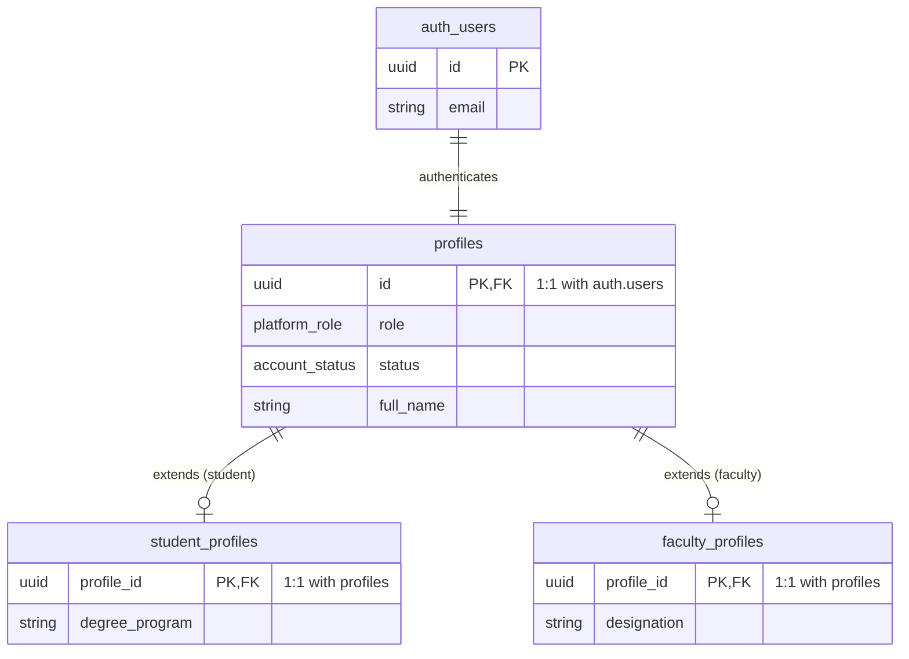
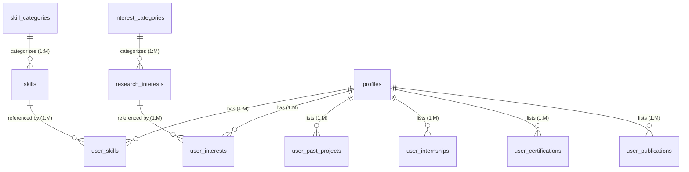
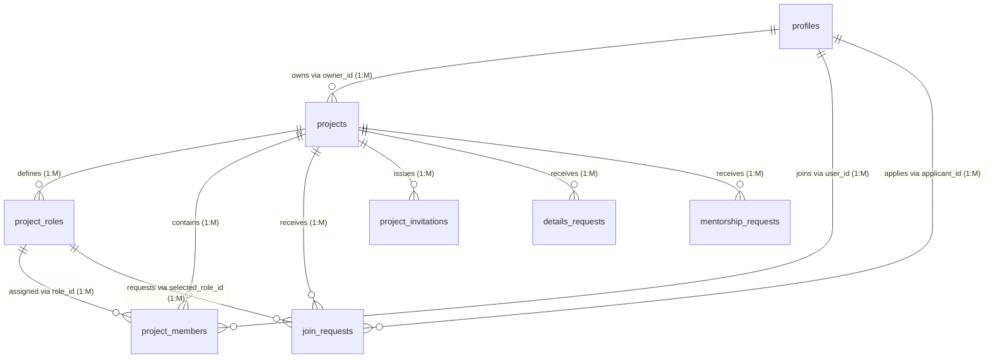
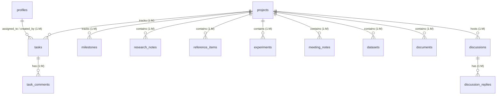
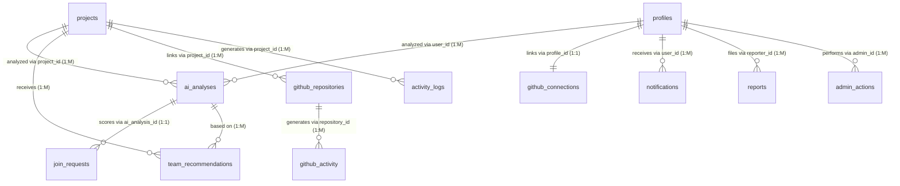
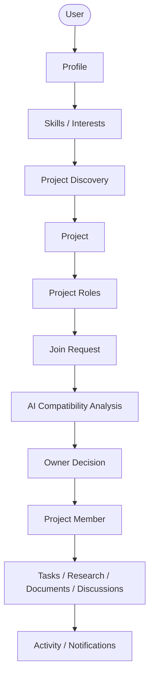
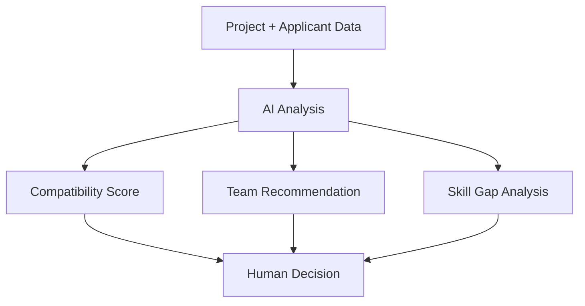
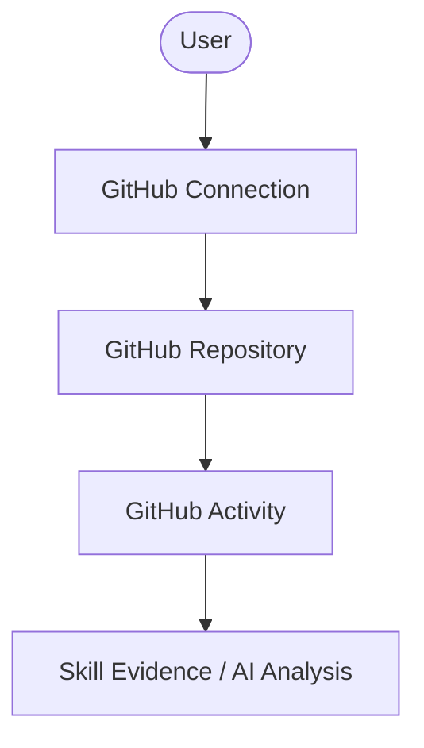
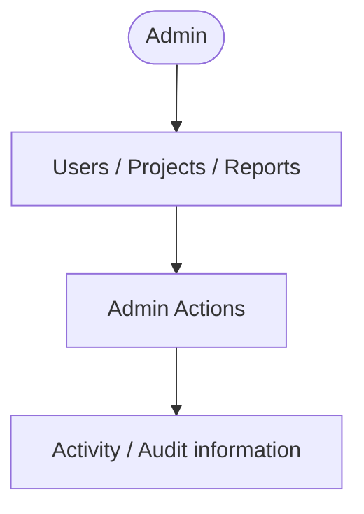

# SYNAPTRA Database Schema Flowchart & Architecture

This document visualizes the complete database architecture for SYNAPTRA, outlining the structural hierarchy, entity relationships (ER), and core data flows. 

---

## 1. Structural Hierarchy

This clean ER-style tree represents the logical grouping and top-down flow of the system components.

```text
AUTH
↓
USERS (auth.users)
↓
PROFILES
├── STUDENT_PROFILES
└── FACULTY_PROFILES

USER DATA
├── USER_SKILLS → SKILLS
├── USER_INTERESTS → RESEARCH_INTERESTS
├── USER_PAST_PROJECTS
├── USER_PUBLICATIONS
├── USER_CERTIFICATIONS
├── USER_INTERNSHIPS
└── GITHUB_CONNECTIONS

PROJECT
↓
PROJECTS
├── PROJECT_ROLES
├── PROJECT_MEMBERS
├── PROJECT_INVITATIONS
├── JOIN_REQUESTS
├── TEAM_RECOMMENDATIONS
├── TASKS
├── TASK_COMMENTS
├── MILESTONES
├── DOCUMENTS
├── RESEARCH_NOTES
├── REFERENCE_ITEMS
├── EXPERIMENTS
├── MEETING_NOTES
├── DATASETS
├── DISCUSSIONS
├── DISCUSSION_REPLIES
├── GITHUB_REPOSITORIES
└── GITHUB_ACTIVITY

AI
├── AI_ANALYSES
└── TEAM_RECOMMENDATIONS

SYSTEM
├── NOTIFICATIONS
├── ACTIVITY_LOGS
├── REPORTS
└── ADMIN_ACTIONS

TAXONOMY
├── SKILLS
├── SKILL_CATEGORIES
├── RESEARCH_INTERESTS
├── INTEREST_CATEGORIES
└── PROJECT_TYPES
```

---

## 2. Entity Relationship (ER) Diagrams

*The following diagrams illustrate the Primary Key (PK) and Foreign Key (FK) relationships, denoting one-to-one (`||--||`), one-to-many (`||--o{`), and many-to-many relationships.*

### A. Authentication & Profiles


### B. Skills, Interests & Taxonomy


### C. Projects & Membership


### D. Collaboration & Research Workspace


### E. AI, GitHub & System


---

## 3. Data & Application Workflows

### Main Application Data Flow


### AI Flow


### GitHub Flow


### Admin Flow

